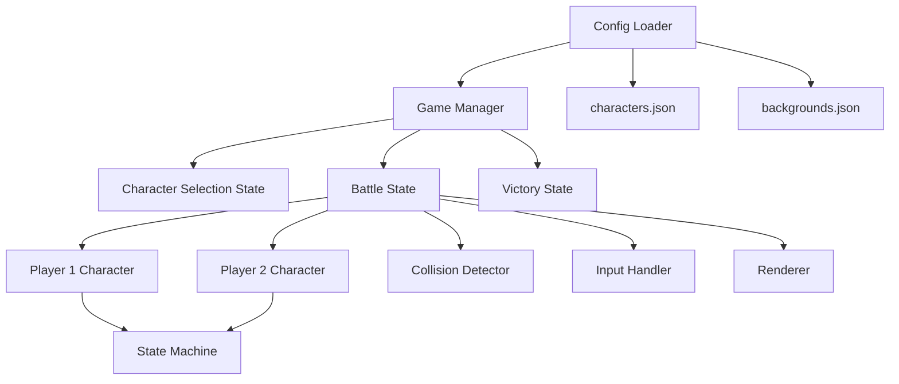
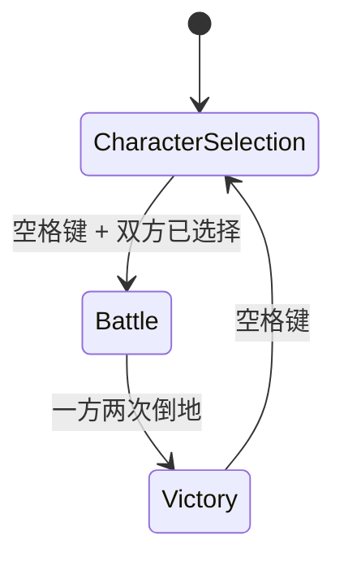
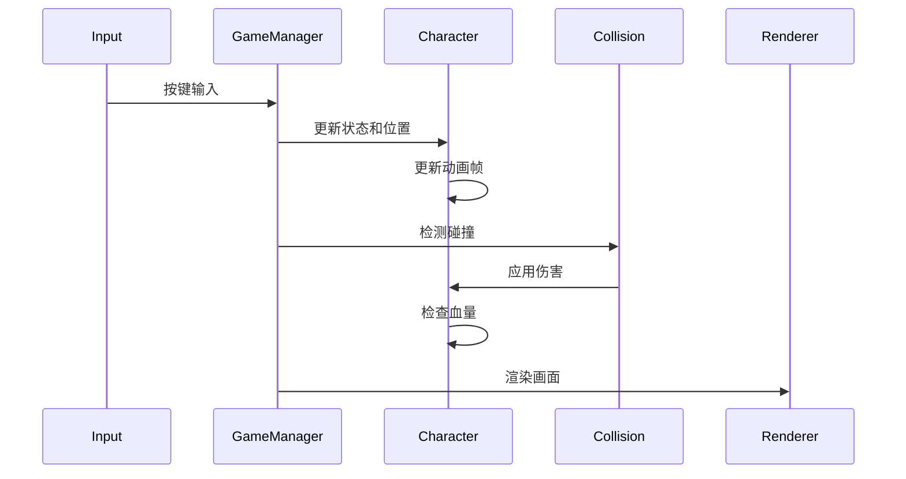

# 设计文档

## 概述

这是一个基于HTML5 Canvas的双人格斗游戏，使用纯JavaScript实现。游戏采用状态机模式管理游戏流程，使用面向对象设计管理角色和游戏逻辑。整个游戏运行在单个HTML页面中，通过Canvas API进行渲染。

## 架构

### 系统架构图



### 核心模块

1. **Game Manager**: 游戏主控制器，管理游戏状态转换和主循环
2. **Config Loader**: 负责加载和解析JSON配置文件
3. **Character**: 角色类，管理角色属性、状态和动画
4. **Input Handler**: 键盘输入处理器
5. **Collision Detector**: 碰撞检测模块
6. **Renderer**: Canvas渲染器
7. **State Machine**: 角色状态机

## 组件和接口

### 1. Game Manager

**职责**: 管理游戏整体流程和状态转换

```javascript
class GameManager {
  constructor(canvas)
  init()
  loadConfigs()
  setState(newState)
  update(deltaTime)
  render()
  startGameLoop()
}
```

**状态枚举**:
- `CHARACTER_SELECTION`: 角色选择
- `BATTLE`: 战斗中
- `VICTORY`: 胜利画面

### 2. Config Loader

**职责**: 加载和验证配置文件

```javascript
class ConfigLoader {
  static async loadCharacters(path)
  static async loadBackgrounds(path)
  static validateCharacterData(data)
  static validateBackgroundData(data)
}
```

### 3. Character

**职责**: 管理单个角色的所有属性和行为

```javascript
class Character {
  constructor(characterData, playerId, isLeftSide)
  
  // 属性
  name
  maxHealthPoint
  currentHealthPoint
  knockdownCount
  position {x, y}
  currentState
  stateTimer
  animationFrame
  animationTimer
  isLeftSide
  
  // 方法
  update(deltaTime)
  changeState(stateName)
  moveLeft()
  moveRight()
  attack()
  takeDamage(damage)
  getHitBox()
  getAttackBox()
  getCurrentImage()
  revive()
  isKnockedOut()
}
```

### 4. Character State

**职责**: 表示角色的一个状态

```javascript
class CharacterState {
  constructor(stateData)
  
  // 属性
  keys
  images [{left_url, right_url, duration}]
  hitBox {x, y, w, h}
  type // 'normal', 'attacking', 'attacked', 'knocked'
  power
  attackBox {x, y, w, h}
  duration
  
  // 方法
  getCurrentFrame(timer)
  isAnimationComplete(timer)
}
```

### 5. Input Handler

**职责**: 处理键盘输入并映射到游戏动作

```javascript
class InputHandler {
  constructor()
  
  // 属性
  keysPressed = new Set()
  keySequences = {player1: [], player2: []}
  sequenceTimer = {player1: 0, player2: 0}
  
  // 方法
  init()
  handleKeyDown(event)
  handleKeyUp(event)
  update(deltaTime)
  checkKeySequence(playerId, targetSequence)
  getPlayerActions(playerId)
}
```

**按键映射**:
```javascript
const KEY_MAPPING = {
  player1: {
    moveLeft: 'a',
    moveRight: 's',
    attack: 'd'
  },
  player2: {
    moveLeft: 'k',
    moveRight: 'l',
    attack: 'j'
  },
  global: {
    start: ' ' // 空格
  }
}
```

### 6. Collision Detector

**职责**: 检测角色之间的碰撞

```javascript
class CollisionDetector {
  static checkCollision(box1, box2)
  static checkAttackHit(attacker, defender)
  static calculateKnockback(attacker, defender)
}
```

### 7. Renderer

**职责**: 渲染游戏画面

```javascript
class Renderer {
  constructor(canvas)
  
  // 方法
  clear()
  drawBackground(background)
  drawCharacter(character)
  drawHealthBar(character, position)
  drawCharacterSelection(characters, selections)
  drawVictoryScreen(winnerName)
  drawText(text, x, y, options)
}
```

### 8. Character Selection Manager

**职责**: 管理角色选择界面逻辑

```javascript
class CharacterSelectionManager {
  constructor(characters)
  
  // 属性
  availableCharacters
  player1Selection = null
  player2Selection = null
  
  // 方法
  handleClick(x, y, playerId)
  isSelectionComplete()
  getSelectedCharacters()
  reset()
}
```

## 数据模型

### Character Data Structure (from characters.json)

```javascript
{
  "character_name": {
    url: string,           // 头像路径
    point: number,         // 初始血量
    status: [
      {
        keys: string[],    // 触发按键序列 ['B', 'F', 'A']
        imgs: [
          {
            left_url: string,   // 角色在左侧时的图片路径
            right_url: string,   // 角色在右侧时的图片路径
            duration: number, // 毫秒
          }
        ],
        block: {           // 受击框
          x: number,
          y: number,
          w: number,
          h: number
        },
        type: string,      // 'normal' | 'attacking' | 'attacked' | 'knocked'
        power: number,     // 攻击力
        attack: {          // 攻击框（可选）
          x: number,
          y: number,
          w: number,
          h: number
        },
        duration: number   // 状态持续时间（毫秒）
      }
    ]
  }
}
```

### Background Data Structure (from backgrounds.json)

```javascript
{
  "background_name": {
    url: string  // 背景图片路径
  }
}
```

### Game State Data

```javascript
{
  currentState: 'CHARACTER_SELECTION' | 'BATTLE' | 'VICTORY',
  player1: Character,
  player2: Character,
  background: Background,
  knockbackState: {
    active: boolean,
    timer: number,
    duration: number
  }
}
```

## 游戏流程

### 状态转换图



### 主游戏循环

```javascript
function gameLoop(timestamp) {
  const deltaTime = timestamp - lastTimestamp
  lastTimestamp = timestamp
  
  // 更新
  inputHandler.update(deltaTime)
  gameManager.update(deltaTime)
  
  // 渲染
  renderer.clear()
  gameManager.render()
  
  requestAnimationFrame(gameLoop)
}
```

### 战斗状态更新流程



## 关键算法

### 1. 按键序列检测

用于检测组合技（如后退+前进+攻击）：

```javascript
// 在0.5秒内检测按键序列
checkKeySequence(playerId, targetSequence) {
  const sequence = this.keySequences[playerId]
  const timer = this.sequenceTimer[playerId]
  
  if (timer > 500) {
    sequence.length = 0
    return false
  }
  
  // 转换方向键为相对方向（B/F）
  const normalizedSequence = this.normalizeSequence(sequence, playerId)
  
  // 检查是否匹配目标序列
  return this.matchSequence(normalizedSequence, targetSequence)
}
```

### 2. 碰撞检测

检测攻击框和受击框的重叠：

```javascript
checkAttackHit(attacker, defender) {
  const attackBox = attacker.getAttackBox()
  const hitBox = defender.getHitBox()
  
  if (!attackBox || !hitBox) return false
  
  return !(
    attackBox.x + attackBox.w < hitBox.x ||
    attackBox.x > hitBox.x + hitBox.w ||
    attackBox.y + attackBox.h < hitBox.y ||
    attackBox.y > hitBox.y + hitBox.h
  )
}
```

### 3. 击退效果

碰撞后双方弹开：

```javascript
calculateKnockback(attacker, defender) {
  const knockbackDistance = 50 // 像素
  const knockbackDuration = 300 // 毫秒
  
  // 根据角色位置决定弹开方向
  if (attacker.position.x < defender.position.x) {
    attacker.targetX = attacker.position.x - knockbackDistance
    defender.targetX = defender.position.x + knockbackDistance
  } else {
    attacker.targetX = attacker.position.x + knockbackDistance
    defender.targetX = defender.position.x - knockbackDistance
  }
  
  return {
    duration: knockbackDuration,
    attacker: attacker.targetX,
    defender: defender.targetX
  }
}
```

### 4. 动画帧更新

循环播放角色动画：

```javascript
updateAnimation(deltaTime) {
  this.animationTimer += deltaTime
  
  const currentFrame = this.currentState.images[this.animationFrame]
  
  if (this.animationTimer >= currentFrame.duration) {
    this.animationTimer = 0
    this.animationFrame = (this.animationFrame + 1) % this.currentState.images.length
  }
}
```

## 错误处理

### 配置文件加载错误

```javascript
try {
  const characters = await ConfigLoader.loadCharacters('./characters.json')
  const backgrounds = await ConfigLoader.loadBackgrounds('./backgrounds.json')
} catch (error) {
  renderer.drawText('配置文件加载失败: ' + error.message, 
                    canvas.width/2, canvas.height/2)
  return
}
```

### 配置验证错误

```javascript
validateCharacterData(data) {
  for (const [name, char] of Object.entries(data)) {
    // 检查必需字段
    if (!char.url || !char.point || !char.status) {
      throw new Error(`角色 ${name} 缺少必需字段`)
    }
    
    // 检查状态类型
    const normalStates = char.status.filter(s => s.type === 'normal')
    const attackedStates = char.status.filter(s => s.type === 'attacked')
    const knockedStates = char.status.filter(s => s.type === 'knocked')
    
    if (normalStates.length !== 1) {
      throw new Error(`角色 ${name} 必须有且仅有一个 normal 状态`)
    }
    if (attackedStates.length !== 1) {
      throw new Error(`角色 ${name} 必须有且仅有一个 attacked 状态`)
    }
    if (knockedStates.length !== 1) {
      throw new Error(`角色 ${name} 必须有且仅有一个 knocked 状态`)
    }
  }
}
```

### 图片加载错误

```javascript
async preloadImage(url) {
  return new Promise((resolve, reject) => {
    const img = new Image()
    img.onload = () => resolve(img)
    img.onerror = () => reject(new Error(`无法加载图片: ${url}`))
    img.src = url
  })
}
```

## 性能优化

### 1. 图片预加载

在游戏开始前预加载所有图片资源：

```javascript
async preloadAllImages() {
  const imageUrls = []
  
  // 收集所有图片URL
  for (const char of Object.values(this.characters)) {
    imageUrls.push(char.url)
    for (const state of char.status) {
      for (const img of state.imgs) {
        imageUrls.push(img.left_url)
        imageUrls.push(img.right_url)
      }
    }
  }
  
  // 并行加载
  await Promise.all(imageUrls.map(url => this.preloadImage(url)))
}
```

### 2. 碰撞检测优化

只在攻击状态时进行碰撞检测：

```javascript
update(deltaTime) {
  // 只在有角色处于攻击状态时检测碰撞
  if (this.player1.currentState.type === 'attacking') {
    this.checkCollision(this.player1, this.player2)
  }
  if (this.player2.currentState.type === 'attacking') {
    this.checkCollision(this.player2, this.player1)
  }
}
```

### 3. Canvas渲染优化

使用离屏Canvas缓存静态背景：

```javascript
cacheBackground(background) {
  const offscreenCanvas = document.createElement('canvas')
  offscreenCanvas.width = this.canvas.width
  offscreenCanvas.height = this.canvas.height
  const ctx = offscreenCanvas.getContext('2d')
  ctx.drawImage(background.image, 0, 0, this.canvas.width, this.canvas.height)
  return offscreenCanvas
}
```

## 测试策略

### 单元测试

测试核心逻辑模块：

1. **ConfigLoader**: 测试JSON解析和验证
2. **CollisionDetector**: 测试碰撞检测算法
3. **Character**: 测试状态转换和伤害计算
4. **InputHandler**: 测试按键序列检测

### 集成测试

测试模块间交互：

1. 测试角色选择流程
2. 测试战斗流程（攻击、受伤、倒地）
3. 测试复活机制
4. 测试游戏结束和重置

### 手动测试场景

1. **角色选择**:
   - 测试选择和取消选择
   - 测试双方选择同一角色
   - 测试未完成选择时按空格

2. **战斗**:
   - 测试基本移动和攻击
   - 测试组合技触发
   - 测试碰撞和伤害
   - 测试击退效果
   - 测试边界限制

3. **复活和结束**:
   - 测试第一次倒地复活
   - 测试第二次倒地游戏结束
   - 测试胜利画面显示
   - 测试重新开始

4. **配置加载**:
   - 测试正常配置加载
   - 测试配置文件缺失
   - 测试配置格式错误
   - 测试图片加载失败

## 文件结构

```
project/
├── index.html              # 主HTML文件
├── styles.css              # 样式文件
├── js/
│   ├── main.js            # 入口文件
│   ├── GameManager.js     # 游戏管理器
│   ├── ConfigLoader.js    # 配置加载器
│   ├── Character.js       # 角色类
│   ├── CharacterState.js  # 角色状态类
│   ├── InputHandler.js    # 输入处理器
│   ├── CollisionDetector.js # 碰撞检测器
│   ├── Renderer.js        # 渲染器
│   └── CharacterSelectionManager.js # 角色选择管理器
├── characters.json         # 角色配置
├── backgrounds.json        # 背景配置
└── assets/                # 资源文件夹
    ├── characters/        # 角色图片
    └── backgrounds/       # 背景图片
```

## 技术栈

- **HTML5 Canvas**: 游戏渲染
- **Vanilla JavaScript (ES6+)**: 游戏逻辑
- **CSS3**: 界面样式
- **JSON**: 配置文件格式

## 浏览器兼容性

目标浏览器：
- Chrome 90+
- Firefox 88+
- Safari 14+
- Edge 90+

所有目标浏览器都支持所需的Canvas API和ES6特性。
